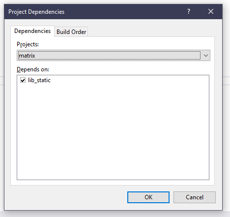
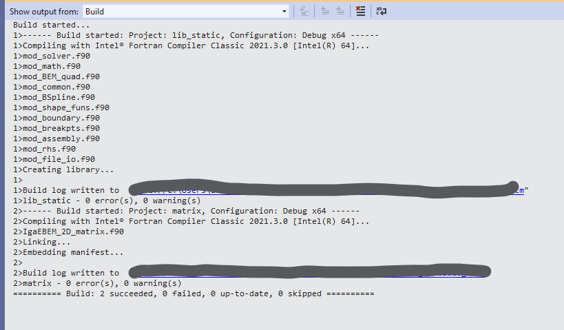
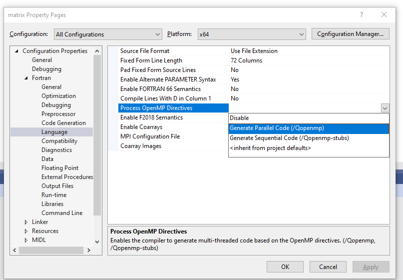

- [Introduction](#introduction)
  - [Fortran compilers](#fortran-compilers)
  - [The Visual Studio IDE](#the-visual-studio-ide)
    - [__Key features__](#key-features)
    - [__Key annoyances__](#key-annoyances)
- [Installation](#installation)
  - [Installing Visual Studio](#installing-visual-studio)
  - [Installing Intel Fortran](#installing-intel-fortran)
  - [Checking the configuration](#checking-the-configuration)
- [General guidelines about Visual Studio 2019](#general-guidelines-about-visual-studio-2019)
- [Compiling a complex code library](#compiling-a-complex-code-library)
  - [__Program unit and subroutines are all in one file__](#program-unit-and-subroutines-are-all-in-one-file)
  - [__Code with modules in separate files__](#code-with-modules-in-separate-files)
  - [__Code with modules in a shared library__](#code-with-modules-in-a-shared-library)
  - [__Programs exchanging files__](#programs-exchanging-files)
  - [__Compilation of parallel code using MPI__](#compilation-of-parallel-code-using-mpi)
- [Conclusion](#conclusion)

> **_NOTE:_** This guide was tested with the latest versions of the software at the time of writing, that is Visual Studio 2019 and Intel Fortran Compiler version 2021.3.0

## Introduction 
As of today Fortran is still one of the leading programming languages for high performance and scientific computing; on the other hand HPC and scientific computing are still a highly specialized niche and, as a result, not many user friendly tools are available for Fortran development. 

In this guide Visual Studio 2019 combined with the Intel Fortran compiler is proposed as a *do-it-all* Fortran IDE for Windows. 
On Linux many different, arguably better, alternatives are available.

### Fortran compilers 
Various Fortran compilers are available, a [comprehensive list](https://fortran-lang.org/learn/os_setup) is available on the [web site of the Fortran Programming Language](https://fortran-lang.org/).

I used the following two compilers
- GNU Fortran, or gfortran, part of the GNU Compiler Collection (GCC), is a Free and Open Source Fortran compiler which is still under active development and supports all the features of the latest Fortran 2018 standard. gfortran is natively available on Linux and MacOS; it is possible to get it on Windows with Windows Subsystem for Linux (WSL) and other workarounds.
- The Intel Fortran Compiler (ifort) is a proprietary compiler developed by Intel; it can be used free of charge for non commercial uses as a part of the Intel oneAPI HPC Toolkit. Intel Fortran is natively available on all platforms; but on Windows is virtually the only free option, thanks to the integration with Visual Studio.

### The Visual Studio IDE
Microsoft Visual Studio 2019 (VS for now on) is a complete and feature rich general purpose IDE; being general purpose it does not natively support Fortran development or other features which might be of interest in the context of scientific computing and, in particular, development of numerical analysis codes.
Fortunately though the integration with Intel compiler and diagnostics tools makes it a viable option for our use case. 
VS is closed source and commercial software, but the _community edition_ is free to use for non commercial purpose with a Microsoft account, the minimal functional limitation of this edition are not of any relevance for our use case.

#### __Key features__
The key features that I found interesting are:
- Automatic determination of compilation order: on Linux I used the [`make`](https://www.gnu.org/software/make/) utility to compile and link the various components of my code; on Windows, due to my poor knowledge of its shell and lack of basic tools, I was not able to use `make`. This was the main reason I resorted to Visual Studio in the first place.
- Support for debugging, signally
  - Execution pause
  - Break point support
  - Variable inspector
- Performance measurement
  - During execution CPU and memory usage are monitored and the runtime is tracked
  - The IDE integrates with Intel performance diagnostics tools `VTune` adn `Advisor` 
    > These tools are also available on Linux as separate applications, but on Windows they integrate in the IDE

#### __Key annoyances__
- There is support for syntax highlighting, but absolutely no support for statement autocompletion
- There is no support for any kind of code exploration
- I suggest to write the code in a more feature rich text editor ([here](https://fortran-lang.org/learn/os_setup/text_editors) are some very useful suggestions) and use VS only for compilation and debugging.

## Installation 
The installation process involves the installation of VS and the Intel HPC Toolkit. It is important to follow the prescribed installation order to get out-of-the-box support. 

### Installing Visual Studio
- We need to download VS community edition from the page https://visualstudio.microsoft.com/it/
- Launch the installer and follow the direction
  - During the installation process we need to check the box of the `Desktop Development with C++` workload
  - If you forget to check this box during the first install you can install the component from the `Visual Studio Installer` application that gets installed along VS. 
- At the end of the procedure, check that VS is installed on your system launching it.
  - On creating a new test project you should still not have options involving Fortran language...

### Installing Intel Fortran 
- The intel fortran compiler is part of the [oneAPI HPC Toolkit](https://software.intel.com/content/www/us/en/develop/tools/oneapi/components/fortran-compiler.html). On the [download page](https://software.intel.com/content/www/us/en/develop/tools/oneapi/hpc-toolkit/download.html?operatingsystem=window&distributions=webdownload&options=online) we suggest to select an *Online* installer.
- Launch the installer and follow the directions:
  - Proceed with a default install (all components are installed)
  - Be sure to check the box _Microsoft Visual Studio 2019_ in the _Integrate IDE_ step
- At the end of the process close the installer. 

### Checking the configuration 
At this point creating a new project in VS an option for Fortran language should appear. We can test the configuration creating a simple `Hello World!" program:
- From the templates, select `Empty Project`
- In the next screen give it a name and a directory to save it. 
- Create a new file in the project: 
  - `Project > Add New Item (Ctrl + Shift + A)`
  - Select the kind of Fortran file you want to create
    > __Keep in mind__ that there is no difference between these choices a part from the file extension, all files are simply plain text files. The extension is used by the IDE to chose what format, syntax highlighting or compiler options to use...
  - In the file we can create a program unit containing the following code :
    ```fortran
    program hello 
        
        implicit none 

        write(*,*) "Hello World from Fortran compiled in Visual Studio 2019"
        pause

    end program hello
    ```
- To run the program press the `Start` in the toolbar, or press the `F5` function key
- If the program runs as expected Visual Studio 2019 should be configured correctly.

## General guidelines about Visual Studio 2019 
The way Visual Studio manages files, directories, projects, solutions, libraries...is quite messy, and gave me a headache at first, mainly because the file structure in VS does not reflect at all in the filesystem, which is quite uncanny from a Linux user perspective...
So I try to summarize the main working concepts and jargon:
- The biggest units are _solutions_, which can contain many _projects_
- A _project_ is the basic unit and corresponds to a program or library
  - A _project_ can contain at most one main program unit
  - All source files for modules used by the main program can be contained in the _project_
  - Modules that we intend to use in more than one main program need to be compiled in a dedicated _project_
    - such _project_ needs to be a _static library_
    - It is possible to create `dynamically-linked libraries` (`dll`s), but more configuration is necessary 
    - The dependency of the _project_ containing the main program on the _project_ containing the modules needs to be set in the _solution_ properties to let the compiler know
  - All the compiler and runtime settings are specified on a _project_ basis in the project properties
- Each _project_ can "contain" source files
  - Files can be created in the project as in the previous example with `Project > Add New Item (Ctrl + Shift + A)`
  - or added from existing files
    > __Note that__  
    > - all the directories and files in the _project_ are _virtual_, that is they do not reflect their location in the filesystem (for some reason 🤔), so the source files can be kept all in a single directory and assigned to different project
    > - Similarly files that in the filesystem are in the same folder as the source files or the project will not appear in the project in VS
    > - The modifications to the files are, of course, reflected in the original files whatever their location in the filesystem
- When `▶Start` in the toolbar or the `F5` key is pressed, the project (along with its dependencies) is compiled and the mai program is executed
  - The _configuration_ specifies the targets and platform
    - By default we have a `debug` and a `deploy` targets
    - ... and we can compile `x86` and `x64` Windows binaries
    - The binaries are saved in a directory specified in the _project_ properties
        >  __Note that__ all setting in the project properties are relative to a single configuration, so pay attention what configuration is being used... I suggest selecting `All Configurations` when changing project properties
  - The execution folder (working directory) is specified int he _project_ properties

## Compiling a complex code library 
Here I illustrate how to get code compiled and running in Visual Studio 2019 through examples based on my experience with my IgA-based Energetic BEM library [IgA-EnergeticBEM](https://github.com/arielsboiardi/IgA-EnergeticBEM).

In all the example we are located in a _solution_ named, for example `IgA-EBEM`

### __Program unit and subroutines are all in one file__
In this case the compilation is very simple: hitting `Start` should do it, if it does not there might be some error in the code.

### __Code with modules in separate files__
This case is again pretty simple: within the same project, Visual Studio automatically determines the dependencies and the right compile order. So we just press `F5` 

### __Code with modules in a shared library__
If we want the modules to be accessible to more than one main program, we can compile them in a _static library_ and link it to the main program. 
- Let us assume that the main program source file `IgaEBEM_2D_matrix.f90` is contained in a project named `matrix` and the modules are in a project named `lib_static`
  - We can check that the modules compile building just the `lib_static` project with the corresponding item of the context menu of the project.
- In `Project > Project Dependencies` we select `matrix` and in `Depends on` check `lib_static`

    

- We can now open the main program source file and press `Start`
    - In the output log we should see that all modules are being compiled 
    - After all the modules the main program gets compiled and executed

        

- We can now create other _projects_ for other main program, and link them against the library with the same procedure
  - In our code library such programs programs would be 
    - `IgaEBEM_2D_rhs.f90`, for the computation of the right-hand side
    - `IgaEBEM_2D_solver.f90`, which implements the time marching solver. 
  
### __Programs exchanging files__
- Our programs are designed to exchange data saved on files, we therefore need to set the same working directory for all the projects tht contain a program unit. 
  - To do so in each project properties under `Debugging` we set `Working Directory` to `$(SolutionDir)/run_dir`, so the programs are executed in a subdirectory `run_dir` of the directory containing all the solution. 
- The `contorno.dat` file and other files needed during the program runtime need to be in `run_dir`

### __Compilation of parallel code using MPI__
To compile the code taking advantage of the parallel implementation
- In each project properties under `Configuration Properties > Fortran > Language > Process OpenMP Directives` we select `Generate Parallel Code`
  
    
  
  - __Note that__ also the library needs to be compiled with the `\Qopenmp` flag

## Conclusion
In this article I ~~hopefully~~ gave a complete introduction to the usage of Visual Studio 2019 and Intel Fortran Compiler aimed at numerical analysts and Fortran developers who need or want to work on Windows.

I will continue to do my coding on Linux, as more powerful tools are freely available, many HPC centers, including the one at my University, ase Linux systems, and I have more control on what I am doing, instead of needing to look for mysterious options and learning funny file structures with their own lexicon.