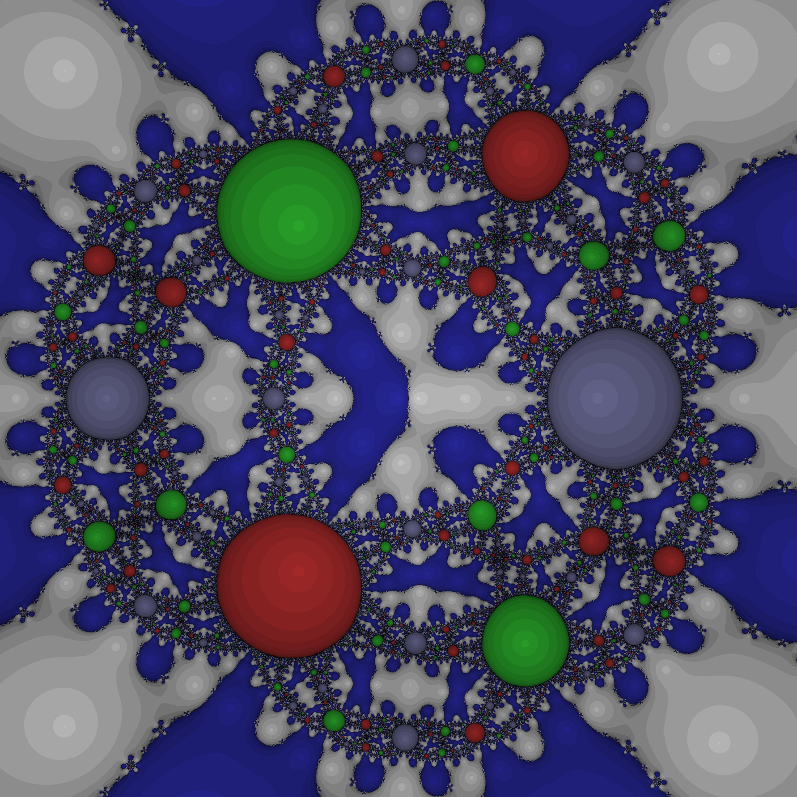
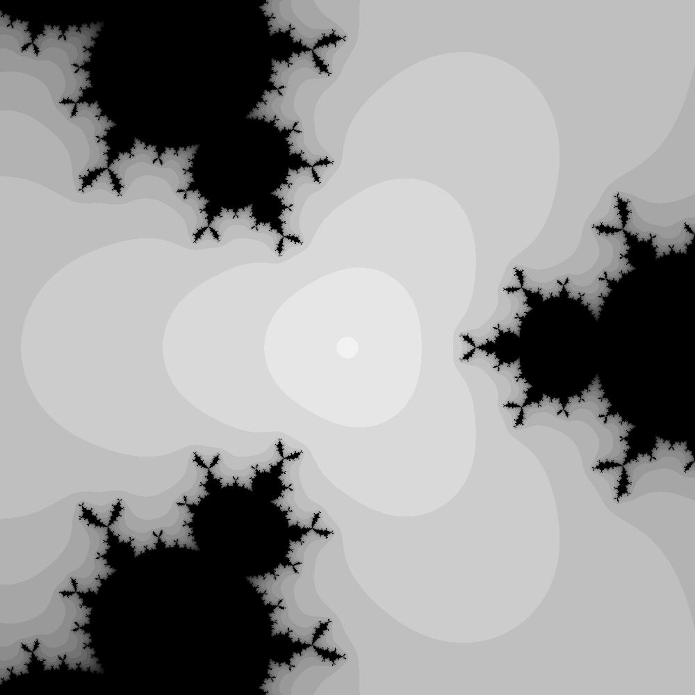

Studying stability properties of the classical Newton solver during the course fo Numerical Mathematics, I took the opportunity to explore the mesmerizing structure of its stable sets, and the chaotic dynamics that lead to the complex roots of polynomials. 

The study has been conducted in MATLAB with some artistic freedom in the choice of colors and shades.

The above image represents the stable sets of the Newton solver looking for the complex roots of the polynomial
$$ x^2(x^3-1). $$
If we move one of the coincident roots just a bit we get 

The so called relaxed newton method instead only converges (fast) to the double root, and avoids the others

The code is of course available at the link under the title, but might need some fixing: the colors in my code are selected from an hard coded list for better artistic results, but of the roots are too many it may run out of colors. 
Feel free to contribute if you want.
The code is also nt really documented, it was just to play around. 
